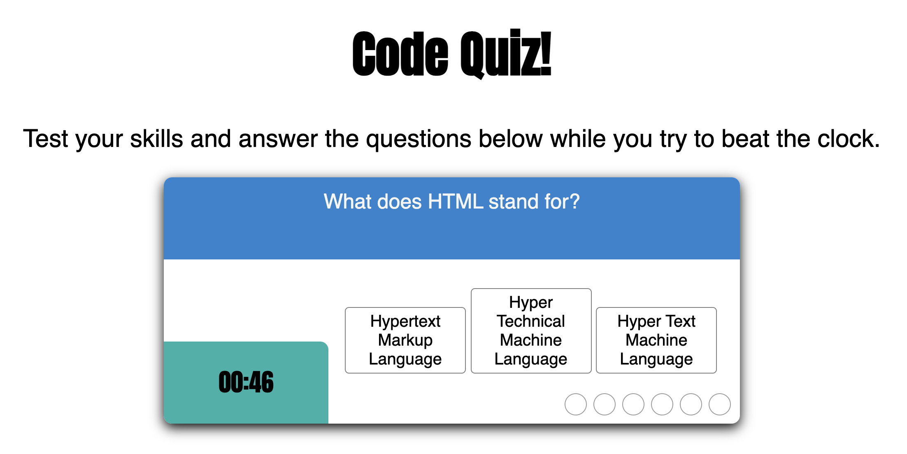

# CodeQuiz_Homework_4
Timed coding quiz with multiple-choice questions.

## Goal:
The goal was to create a multiple choice quiz that that ran against the clock and tracked high scores using local storage.

## Issues:
- Was not able to get the user's results to show on the screen. 

## Results:

The end product looks good however there are a few bugs that I couldn't quite figure out. As stated above I need to review getting items from local storage so that I can get the user's scores to show on the screen.

## Summary:
This assignment was extremely challenging for me. Javascript in general is, this assignment was a great gauge for where I am at and where I need to put in more time. 

## Table of Contents
- [Goal](#Goal)
- [Issues](#Issues)
- [Results](#Results)
- [Summary](#Summary)

_____
### License
MIT License, Copyright (c) [2021] [StephanieGaston]

